# Modelo de Datos (ERD)

Este documento define el modelo de datos relacional para el MVP de HyperBrain. Representa los siete dominios principales del ecosistema: Users, Core, Finance, Learning, Telemetry, Brain y Sync/Common.

Para la especificación detallada de cada dominio, consultar los motores de ejecución correspondientes en la sección de [Arquitectura](index.md).

---

## Diagrama ERD

```mermaid
erDiagram
    %% --- USERS DOMAIN ---
    SYS_USER ||--o{ CORE_EXECUTABLE : "owns"
    SYS_USER ||--o{ FIN_ACCOUNT : "owns"
    SYS_USER ||--o{ SYNC_CREDENTIAL : "configures"
    SYS_USER ||--o{ LRN_TOPIC : "studies"

    SYS_USER {
        UUID id PK
        String email
        String password_hash
        String role "ADMIN | USER"
        String status "ACTIVE | INACTIVE"
        OffsetDateTime created_at
    }

    SYNC_CREDENTIAL {
        UUID id PK
        UUID user_id FK
        String provider "NOTION | APPLE | N8N"
        String access_token
        String refresh_token
        OffsetDateTime expires_at
    }

    %% --- CORE DOMAIN ---
    CORE_CYCLE ||--o{ CORE_EXECUTABLE : "organizes"
    CORE_EXECUTABLE ||--o{ CORE_EXECUTABLE : "hierarchy via parentId"
    CORE_EXECUTABLE ||--|| CORE_EXECUTION_PROFILE : "profile"
    CORE_EXECUTABLE ||--o{ CORE_TIME_BLOCK : "tracks"
    CORE_PROJECT ||--o{ CORE_EXECUTABLE : "groups"
    CORE_PROJECT ||--o{ FIN_GOAL : "links goal"

    CORE_CYCLE {
        UUID id PK
        String name
        LocalDate start_date
        LocalDate end_date
        String type "MCI | ROUTINE | PHASE"
        String status "ACTIVE | COMPLETED"
    }

    CORE_EXECUTABLE {
        UUID id PK
        UUID user_id FK
        UUID parent_id FK
        UUID cycle_id FK
        String name
        String description
        String type "TASK | HABIT | LEAD_MEASURE | ACTIVITY | AGENDA | LEARNING_SESSION"
        String status "TODO | IN_PROGRESS | DONE | FAILED | PLANNED"
        Double priority_score
        Double urgence_score
        Double effort_score
        BigDecimal estimated_cost
        OffsetDateTime start_time
        OffsetDateTime end_time
        String source_calendar
    }

    CORE_EXECUTION_PROFILE {
        UUID executable_id PK, FK
        Integer estimated_minutes
        Integer energy_drain "1-5"
        Integer mental_load "1-5"
        Integer impact "1-8 Fibonacci"
    }

    CORE_TIME_BLOCK {
        UUID id PK
        UUID executable_id FK
        OffsetDateTime date_start
        OffsetDateTime date_end
        Integer actual_duration_minutes
    }

    CORE_PROJECT {
        UUID id PK
        String name
        String status
    }

    %% --- FINANCE DOMAIN ---
    FIN_ACCOUNT ||--o{ FIN_TRANSACTION : "origin or dest"
    FIN_CATEGORY ||--o{ FIN_TRANSACTION : "classifies"
    FIN_CATEGORY ||--o{ FIN_BUDGET : "restricts"
    FIN_GOAL ||--o{ FIN_TRANSACTION : "contributes to"
    CORE_EXECUTABLE ||--o{ FIN_TRANSACTION : "real cost"

    FIN_ACCOUNT {
        UUID id PK
        UUID user_id FK
        String name
        String type "ASSET | LIABILITY"
        BigDecimal balance
        String currency
    }

    FIN_TRANSACTION {
        UUID id PK
        UUID executable_id FK
        UUID origin_account_id FK
        UUID destination_account_id FK
        UUID category_id FK
        UUID cycle_id FK
        BigDecimal amount
        String currency
        String description
        String type "INCOME | EXPENSE | TRANSFER"
        String status "PLANNED | PENDING | COMPLETED"
        OffsetDateTime occurred_at
    }

    FIN_CATEGORY {
        UUID id PK
        UUID parent_id FK
        String name
        String flow_type "INCOME | EXPENSE"
    }

    FIN_GOAL {
        UUID id PK
        UUID cycle_id FK
        UUID project_id FK
        String name
        BigDecimal target_amount
        BigDecimal accumulated_amount
        String status "SAVING | FUNDED | COMPLETED"
        LocalDate target_date
    }

    FIN_BUDGET {
        UUID id PK
        UUID category_id FK
        String name
        LocalDate start_date
        LocalDate end_date
        BigDecimal limit_amount
        String carry_policy "ROLLOVER | RESET"
    }

    %% --- LEARNING DOMAIN ---
    CORE_EXECUTABLE ||--o{ LRN_ASSESSMENT : "triggers evaluation"
    LRN_TOPIC ||--o{ LRN_ASSESSMENT : "is evaluated in"

    LRN_TOPIC {
        UUID id PK
        UUID user_id FK
        String name
        String description
        String status "ACTIVE | MASTERED | ARCHIVED"
        Integer current_score "0-100"
        OffsetDateTime next_review_date
    }

    LRN_ASSESSMENT {
        UUID id PK
        UUID topic_id FK
        UUID executable_id FK
        Integer score_internals "0-100"
        Integer score_architecture "0-100"
        Integer score_production "0-100"
        Integer score_seniority "0-100"
        Integer score_general "0-100"
        String identified_gaps
        String recommended_prompt "A | B | C | D | E"
        OffsetDateTime assessed_at
    }

    %% --- TELEMETRY and COGNITIVE DOMAIN ---
    TEL_SLEEP_RECORD {
        UUID id PK
        OffsetDateTime start_time
        OffsetDateTime end_time
        Integer duration_minutes
        Integer sleep_score
        JSONB stages
        OffsetDateTime collected_at
    }

    TEL_ACTIVITY_STREAM {
        UUID id PK
        String app_name
        String window_title
        OffsetDateTime start_time
        Integer duration_seconds
        Boolean is_afk
    }

    BRAIN_IDEA {
        UUID id PK
        String title
        String content
        String status "RAW | REFINING | ARCHIVED | CONVERTED"
        UUID converted_to_id FK
        OffsetDateTime created_at
    }

    CONTEXT_EVENT {
        UUID id PK
        String source "MANUAL | SYSTEM | INTEGRATION"
        String provider
        String event_type
        String content
        JSONB payload
        OffsetDateTime occurred_at
    }

    %% --- SYNC and SYSTEM INFRASTRUCTURE ---
    SYNC_MAPPINGS {
        UUID id PK
        UUID local_id
        String external_system "NOTION | APPLE"
        String external_id
        String last_known_checksum
        String sync_status
        OffsetDateTime last_synced_at
    }

    OUTBOX_EVENTS {
        UUID id PK
        String aggregate_type
        String aggregate_id
        String event_type
        JSONB payload
        Boolean processed
        String source_system
        OffsetDateTime occurred_at
    }

    %% --- RELATIONSHIPS ---
    CORE_EXECUTABLE ||--o{ SYNC_MAPPINGS : "syncs via"
    FIN_TRANSACTION ||--o{ SYNC_MAPPINGS : "syncs via"
    CORE_EXECUTABLE ||--o{ BRAIN_IDEA : "originates from"
```

