# Modelo de Datos (ERD)

Este documento define el modelo de datos relacional para el MVP de HyperBrain, complementado con la **Gestión de Usuarios** y los **Mecanismos de Sincronización** para sistemas externos.

El siguiente diagrama Entidad-Relación (ERD) en Mermaid representa los seis dominios principales del ecosistema (Users, Core, Finance, Telemetry, Brain, Sync/Common) y cómo interactúan entre sí.

## Diagrama ERD

```mermaid
erDiagram
    %% --- USERS DOMAIN (MVP & Security) ---
    SYS_USER ||--o{ CORE_EXECUTABLE : "owns"
    SYS_USER ||--o{ FIN_ACCOUNT : "owns"
    SYS_USER ||--o{ SYNC_CREDENTIAL : "configures"

    SYS_USER {
        UUID id PK
        String email
        String password_hash
        String role "ADMIN, USER"
        String status "ACTIVE, INACTIVE"
        OffsetDateTime created_at
    }
    
    SYNC_CREDENTIAL {
        UUID id PK
        UUID user_id FK
        String provider "NOTION, APPLE, N8N"
        String access_token
        String refresh_token
        OffsetDateTime expires_at
    }

    %% --- CORE DOMAIN (Productivity & Execution) ---
    CORE_CYCLE ||--o{ CORE_EXECUTABLE : "organizes"
    CORE_EXECUTABLE ||--o{ CORE_EXECUTABLE : "hierarchy (parentId)"
    CORE_EXECUTABLE ||--|| CORE_EXECUTION_PROFILE : "profile"
    CORE_EXECUTABLE ||--o{ CORE_TIME_BLOCK : "tracks"
    CORE_PROJECT ||--o{ CORE_EXECUTABLE : "groups"
    CORE_PROJECT ||--o{ FIN_GOAL : "links goal"

    CORE_CYCLE {
        UUID id PK
        String name
        LocalDate start_date
        LocalDate end_date
        String type "MCI, ROUTINE, PHASE"
        String status "ACTIVE, COMPLETED"
    }

    CORE_EXECUTABLE {
        UUID id PK
        UUID user_id FK
        UUID parent_id FK
        UUID cycle_id FK
        String name
        String description
        String type "TASK, HABIT, LEAD_MEASURE, ACTIVITY, AGENDA"
        String status "TODO, IN_PROGRESS, DONE, FAILED, PLANNED"
        Double priority_score
        Double urgence_score
        Double effort_score
        BigDecimal estimated_cost
        OffsetDateTime start_time
        OffsetDateTime end_time
        String source_calendar
    }

    CORE_EXECUTION_PROFILE {
        UUID executable_id PK, FK
        Integer estimated_minutes
        Integer energy_drain "1-5"
        Integer mental_load "1-5"
        Integer impact "1-8 (Fibonacci)"
    }

    CORE_TIME_BLOCK {
        UUID id PK
        UUID executable_id FK
        OffsetDateTime date_start
        OffsetDateTime date_end
        Integer actual_duration_minutes
    }
    
    CORE_PROJECT {
        UUID id PK
        String name
        String status
    }

    %% --- FINANCE DOMAIN ---
    FIN_ACCOUNT ||--o{ FIN_TRANSACTION : "origin/dest"
    FIN_CATEGORY ||--o{ FIN_TRANSACTION : "classifies"
    FIN_CATEGORY ||--o{ FIN_BUDGET : "restricts"
    FIN_GOAL ||--o{ FIN_TRANSACTION : "contributes to"
    CORE_EXECUTABLE ||--o{ FIN_TRANSACTION : "real cost"

    FIN_ACCOUNT {
        UUID id PK
        UUID user_id FK
        String name
        String type "ASSET, LIABILITY"
        BigDecimal balance
        String currency
    }

    FIN_TRANSACTION {
        UUID id PK
        UUID executable_id FK
        UUID origin_account_id FK
        UUID destination_account_id FK
        UUID category_id FK
        UUID cycle_id FK
        BigDecimal amount
        String currency
        String description
        String type "INCOME, EXPENSE, TRANSFER"
        String status "PLANNED, PENDING, COMPLETED"
        OffsetDateTime occurred_at
    }

    FIN_CATEGORY {
        UUID id PK
        UUID parent_id FK
        String name
        String flow_type "INCOME, EXPENSE"
    }

    FIN_GOAL {
        UUID id PK
        UUID cycle_id FK
        UUID executable_id FK
        String name
        BigDecimal target_amount
        BigDecimal accumulated_amount
        String status "SAVING, FUNDED, COMPLETED"
        LocalDate target_date
    }

    FIN_BUDGET {
        UUID id PK
        UUID category_id FK
        String name
        LocalDate start_date
        LocalDate end_date
        BigDecimal limit_amount
    }

    %% --- TELEMETRY & COGNITIVE DOMAIN ---
    TEL_SLEEP_RECORD {
        UUID id PK
        OffsetDateTime start_time
        OffsetDateTime end_time
        Integer duration_minutes
        Integer sleep_score
        JSONB stages
        OffsetDateTime collected_at
    }

    TEL_ACTIVITY_STREAM {
        UUID id PK
        String app_name
        String window_title
        OffsetDateTime start_time
        Integer duration_seconds
        Boolean is_afk
    }

    BRAIN_IDEA {
        UUID id PK
        String title
        String content
        String status "RAW, REFINING, ARCHIVED, CONVERTED"
        UUID converted_to_id FK "Maps to CoreExecutable"
        OffsetDateTime created_at
    }

    CONTEXT_EVENT {
        UUID id PK
        String source "MANUAL, SYSTEM, INTEGRATION"
        String provider
        String event_type
        String content
        JSONB payload
        OffsetDateTime occurred_at
    }

    %% --- LEARNING DOMAIN (Study Manager) ---
    CORE_EXECUTABLE ||--o{ LRN_ASSESSMENT : "triggers evaluation"
    LRN_TOPIC ||--o{ LRN_ASSESSMENT : "is evaluated in"

    LRN_TOPIC {
        UUID id PK
        UUID user_id FK
        String name
        String description
        String status "ACTIVE, MASTERED, ARCHIVED"
        Integer current_score "0-100"
        OffsetDateTime next_review_date
    }

    LRN_ASSESSMENT {
        UUID id PK
        UUID topic_id FK
        UUID executable_id FK
        Integer score_internals "0-100"
        Integer score_architecture "0-100"
        Integer score_production "0-100"
        Integer score_seniority "0-100"
        Integer score_general "0-100"
        String identified_gaps
        String recommended_prompt "PROMPT_A, PROMPT_B, PROMPT_C, PROMPT_D, PROMPT_E"
        OffsetDateTime assessed_at
    }

    %% --- SYNC & SYSTEM INFRASTRUCTURE ---
    SYNC_MAPPINGS {
        UUID id PK
        UUID local_id "ID of CoreExecutable or FinTx"
        String external_system "NOTION, APPLE"
        String external_id "ID in Notion or EventKit"
        String last_known_checksum "Hash for Loop Protection"
        String sync_status
        OffsetDateTime last_synced_at
    }

    OUTBOX_EVENTS {
        UUID id PK
        String aggregate_type
        String aggregate_id
        String event_type
        JSONB payload
        Boolean processed
        String source_system "Loop Protection"
        OffsetDateTime occurred_at
    }

    %% Relationships Mapping
    CORE_EXECUTABLE ||--o{ SYNC_MAPPINGS : "syncs via"
    FIN_TRANSACTION ||--o{ SYNC_MAPPINGS : "syncs via"
    CORE_EXECUTABLE ||--o{ BRAIN_IDEA : "originates from"
```

## Especificación de Dominios

### 1. Gestión de Usuarios y Seguridad (MVP)
Para el MVP, se introduce el schema de usuarios que rige la autenticación y el control de acceso:
- **`SYS_USER`**: Define si un usuario es `ADMIN` (ej. el SysAdmin que despliega la infraestructura) o `USER`. Centraliza la propiedad de cuentas financieras, tareas y credenciales de integración.
- **`SYNC_CREDENTIAL`**: Almacena de forma segura los tokens de acceso para Notion, Apple y n8n, permitiendo la comunicación saliente autenticada.

### 2. Productividad y Ejecución (Core)
- **`CORE_EXECUTABLE`**: La unidad de ejecución base. Puede ser una tarea aislada, un hábito o una medida de predicción (*Lead Measure*). 
- **`CORE_EXECUTION_PROFILE`**: Desacopla las métricas cualitativas (impacto de Fibonacci, carga mental) del núcleo de la tarea, crucial para el motor de priorización de la IA.
- **`CORE_CYCLE` & `CORE_PROJECT`**: Permiten agrupar estratégicamente los ejecutables alineados a metodologías GTD o 4DX.

### 3. Sincronización y Prevención de Loops
La consistencia es mantenida por el patrón `SYNC_MAPPINGS`.
- **`SYNC_MAPPINGS`**: Mapeo polimórfico mediante `local_id`. Almacena el `last_known_checksum` para validar que un cambio proveniente de Notion o Apple sea **real** y no producto de un evento reflejado (Loop Protection).
- **`OUTBOX_EVENTS`**: Patrón de persistencia distribuida para inyectar con seguridad a Kafka (*Transactional Outbox*).

### 4. Aprendizaje Continuo (Learning Engine)
Este módulo se acopla a la productividad para fungir como un "Gestor de Estudio" impulsado por IA:
- **`LRN_TOPIC`**: El tema a dominar. Rastrea su estado de maestría (`current_score`) y la fecha de su próximo repaso espaciado.
- **`LRN_ASSESSMENT`**: Registro inmutable de cada sesión de estudio (evaluada por la IA). Guarda puntajes específicos (Internals, Architecture, Production) y detecta las brechas técnicas. Su resultado dicta qué Prompt (A, B, C, D o E) debe utilizarse en la siguiente iteración. Está fuertemente ligado a un `CORE_EXECUTABLE` para integrar el esfuerzo cognitivo con el `Agenda Planner`.

### 5. Inteligencia Artificial (Brain & Telemetry)
Las tablas de este dominio actúan como el histórico *crudo* que consultan el RAG y los LLMs:
- **`TEL_SLEEP_RECORD` / `TEL_ACTIVITY_STREAM`**: Sensores pasivos que afectan directamente los multiplicadores de la fórmula del `Agenda Planner`.
- **`BRAIN_IDEA`**: Ingesta NLP cruda antes de ser refinada en un `CORE_EXECUTABLE`.
