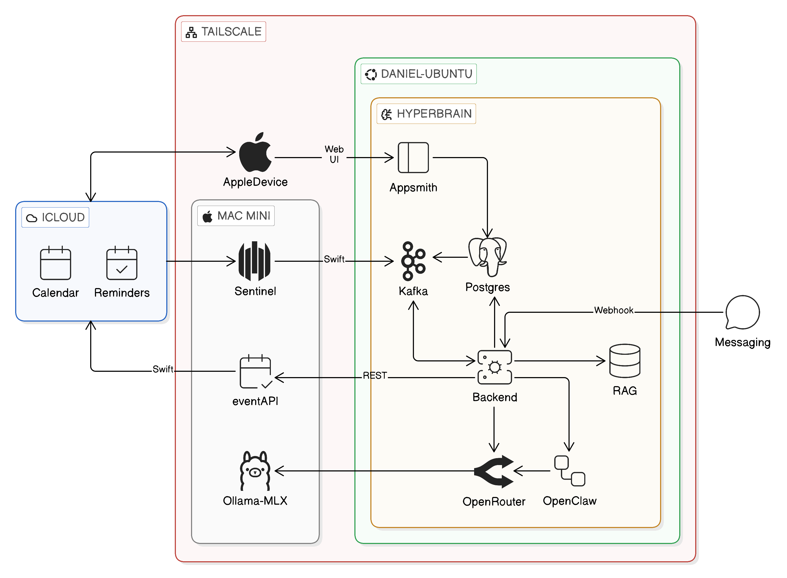
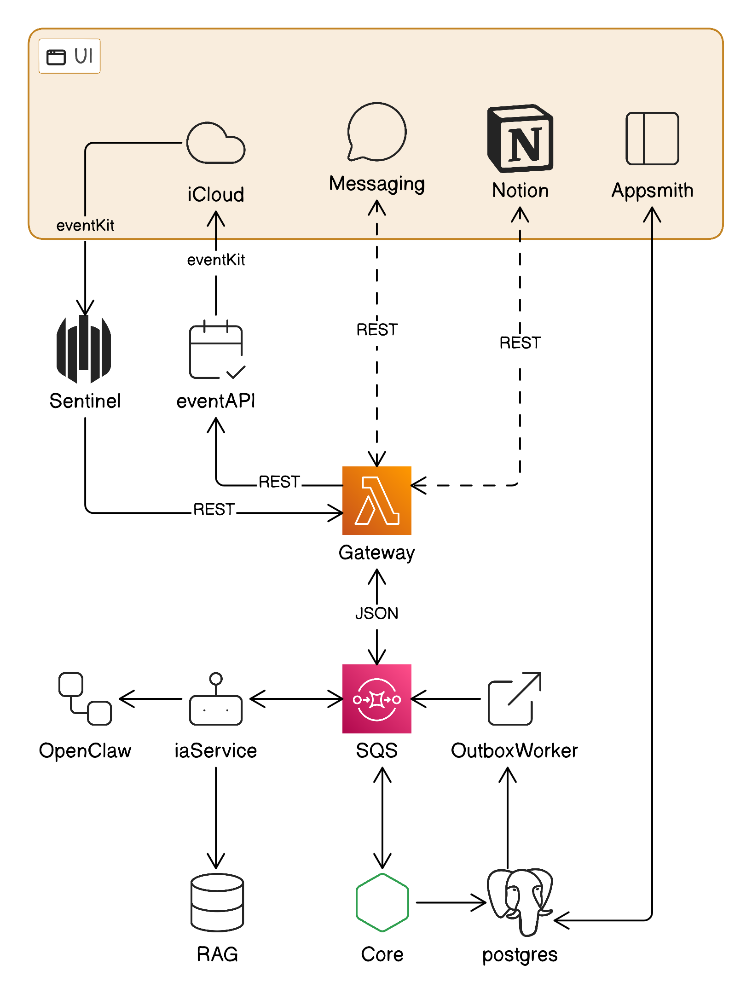
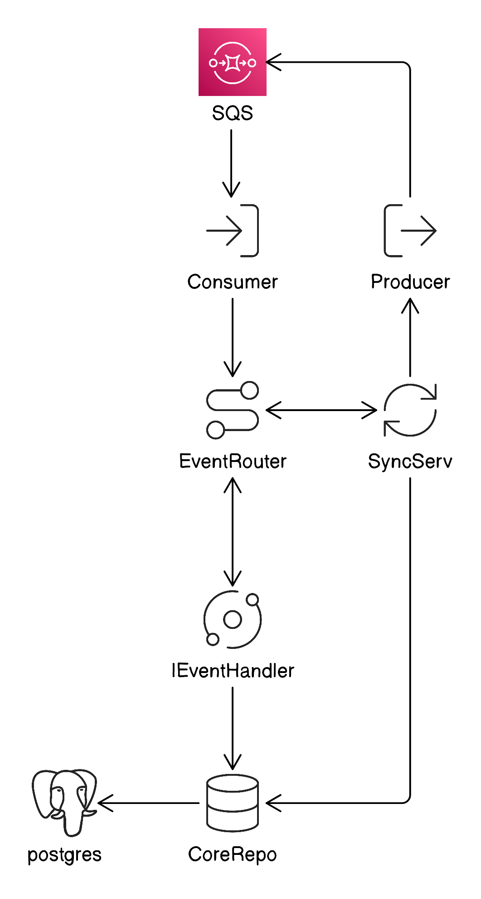
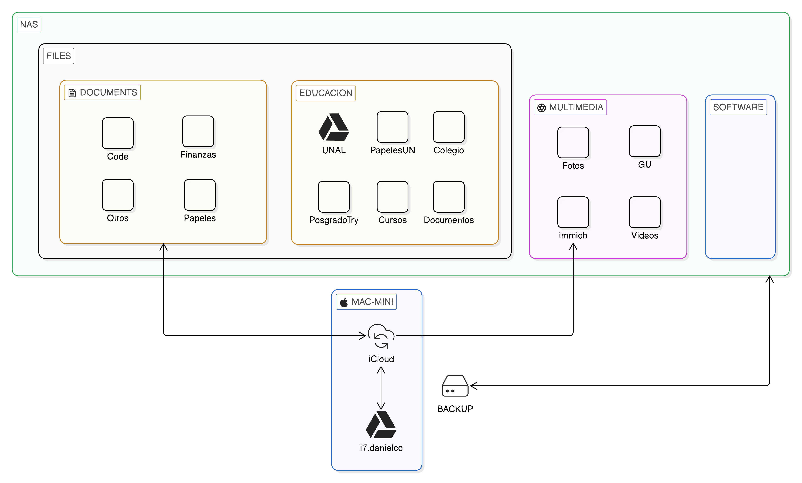
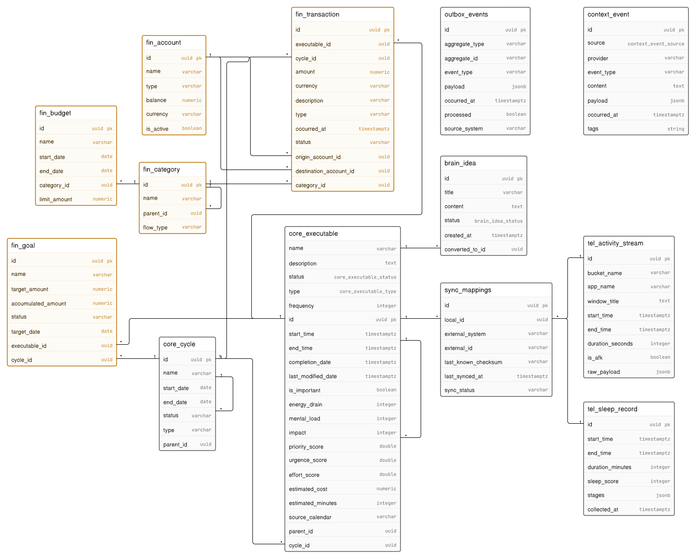

# Diagramas de Arquitectura

Diagramas generados y mantenidos en [Eraser.io](https://app.eraser.io/workspace/qufdoKZ8oNs9GJjafWv0).

> ✏️ **[Abrir y editar en Eraser](https://app.eraser.io/workspace/qufdoKZ8oNs9GJjafWv0)**

---

## Deployment

Diagrama de despliegue de infraestructura del sistema.

---

## Components

Diagrama de componentes y sus relaciones.

---

## Core

Diagrama del núcleo del sistema.

---

## Cloud Architecture

Arquitectura en la nube.

---

## Varchar

---

!!! tip "Actualizar diagramas"
    Cuando actualices un diagrama en Eraser.io y lo sincronices al repositorio,
    copia los PNGs actualizados desde `.eraser/` hacia `docs/assets/diagrams/`
    con los nombres limpios correspondientes.
