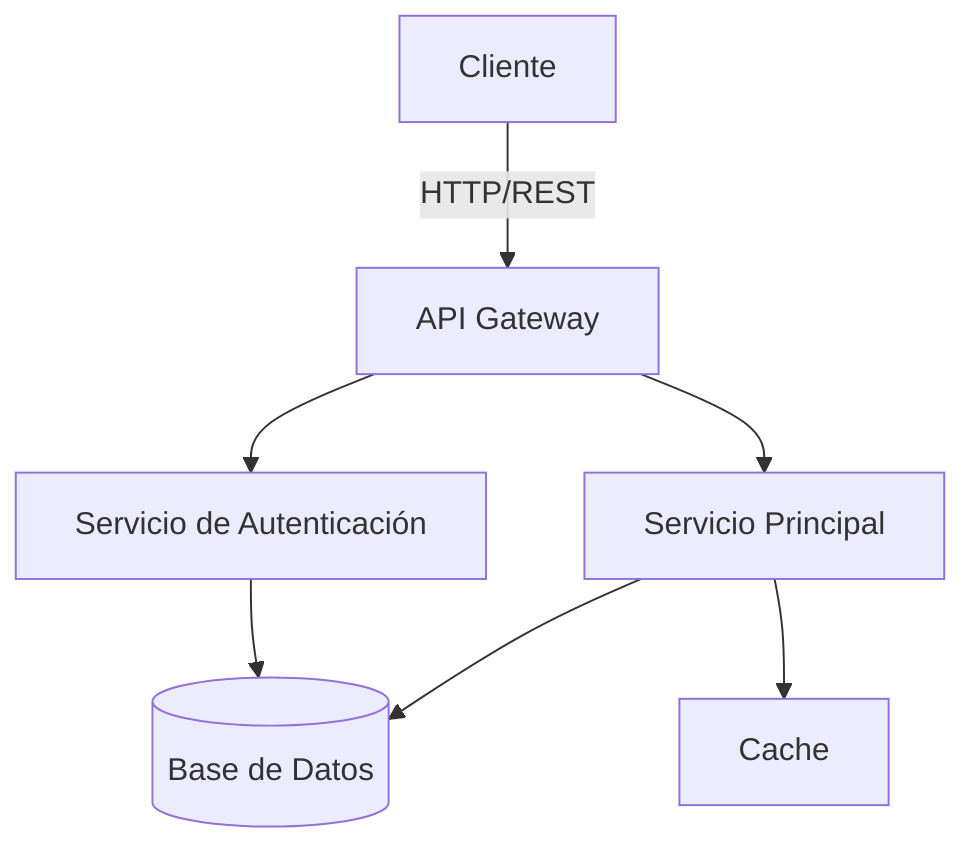

# Arquitectura - Visión General

## Diagrama del Sistema

## Componentes Principales

### API Gateway
Punto de entrada único para todas las peticiones. Se encarga del enrutamiento y balanceo de carga.

### Servicio de Autenticación
Gestiona la autenticación y autorización de usuarios mediante tokens JWT.

### Servicio Principal
Contiene la lógica de negocio central de HyperBrain.

### Base de Datos
Almacenamiento persistente de datos del sistema.

### Cache
Capa de caché para optimizar el rendimiento de consultas frecuentes.

## Flujo de una Petición

1. El cliente envía una petición HTTP
2. El API Gateway recibe y valida la petición
3. Se verifica la autenticación del usuario
4. La petición se enruta al servicio correspondiente
5. Se procesa la lógica de negocio
6. Se devuelve la respuesta al cliente

!!! info "Tecnologías"
    La arquitectura está diseñada para ser modular y escalable, permitiendo agregar nuevos servicios según sea necesario.
